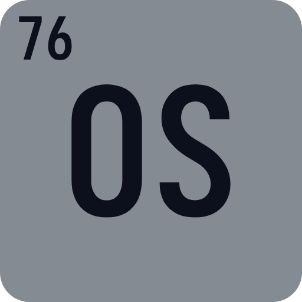

    

    <strong>Osmium</strong>
    
The programming language with the atomic number of 76.

    
    

    

# The Osmium Programming Language
Osmium is a compiled general-purpose programming language with the goal of being
enjoyable to program in. It features a highly abbreviated and short syntax that
aims to make lines of code shorter.
# Compiling
To compile your Osmium code, simply follow these steps:
* Download the "main.exe" file and name it whatever you want.
* Call the executable in a terminal with a file location to compile.
    * To specify the output file names, include "-out \[name\]" at the end of the command.
* Run the ".out" file generated, and you have just ran compiled Osmium code!
# V0.2 Changelog
With the new Early Beta V0.2 version, the following has been added to the Osmium programming language:
* While loops.
* Breaking and continuing within while loops.
* Non-entry point function defintions.
* Function calling.
* Non-exiting returns.
# Warnings
* The compiler is still in development.
* The compiler doesn't have many features yet.
* The compiler currently can only be ran on Linux; use a VM if you are not on Linux.
* Bugs are to be expected, as the language is in early beta.\
    *(Please sumbit an issue/pull request to the repository if you find a bug.)*